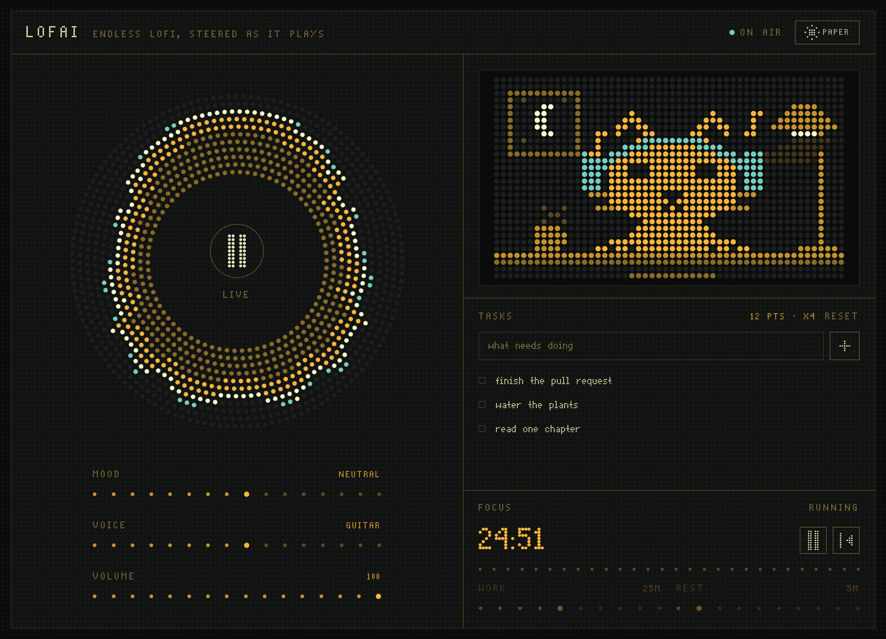

# LofAI

An AI generated lofi music player. Every listener gets their own endless stream, generated live, and switching stations bends the music as it plays.

## Screenshot:



## How it Works:

- Google DeepMind's Magenta RealTime 2 (`mrt2_small`) is the live performer and renderer. Every 40ms it samples SpectroStream tokens, decodes 48kHz stereo audio, and carries a separate recurrent state for each listener
- The live path is prompt-first: one concise MusicCoCa station embedding guides MRT2 while its own audio history supplies the musical continuity. Piano-roll generation, bar clocks, and per-frame score churn stay out of the hot loop
- Four curated stations provide coherent style targets. The only musical override is drums on/off; station changes start on the next model chunk and glide over 320ms
- **New take** resets the recurrent model state and sampling seed together, then prevents old in-flight audio from leaking into the new variation
- Long takes are guarded against the model's one bad habit: it can slowly amplify a hiss bed it has fed back to itself through its own audio history - broadband hiss between notes on sparse stations, a 14-20 kHz whistle under the beat on busy ones. The backend watches the quiet moments of each stream and, when their high band audibly rises and stays up for half a minute (or gets loud enough to be hiss on any station), crossfades onto a fresh model state mid-stream - a subtle track change instead of a slowly degrading one
- Raw PCM travels over a WebSocket into one AudioWorklet read cursor. Fixed makeup gain compensates for codec headroom; a limiter and output ceiling catch peaks. Quiet passages keep their dynamics, with no automatic gain increase that could amplify hiss
- Eight-bit weights, a specialized per-frame step loop, GPU keepalive, short startup chunks, and adaptive 10-12 layer codec output keep generation ahead of playback. Tokens for a whole chunk are sampled first and decoded through the codec in one call, and the step is traced with `mx.compile`, so the model thread spends its time on the GPU rather than in Python. The browser starts from a sub-second reservoir instead of hiding deficits behind seconds of buffering
- The old symbolic composer remains available only to the offline evaluation harness for matched, fixed-seed comparisons. Signal metrics catch broken audio; people decide whether the result is good music

See [the streaming design note](docs/MUSIC_STREAMING.md) for the full MRT2 pipeline, bottleneck analysis, and local benchmarks.

## Languages and Frameworks:

- **Backend**: Python, FastAPI, WebSockets
- **Frontend**: Next.js, React, TypeScript, Tailwind CSS, Canvas 2D
- **AI**: Google DeepMind's Magenta RealTime 2 live music model (MLX)

## The Interface:

Five separate designs are available at the numbered routes. `/` and `/1` keep the original interface; its Menu also links to all five spaces.

| Route | Design | Listening experience |
|---|---|---|
| `/1` | Original | The existing radio, cat, tasks, timer, and color themes |
| `/2` | Sunday | An editorial listening room with paper textures, serif type, and illustrated station sleeves |
| `/3` | Form | A Swiss-inspired workspace with quick listening presets and a prominent focus timer |
| `/4` | Signal | A tactile stereo receiver with station memory keys and an illuminated frequency display |
| `/5` | Afterglow | An immersive night player with a compact mixer and a workspace drawer |

The new designs reuse the dot-matrix visualizer, animated cat, task list, timer, and audio engine. Their **Make it yours** panel provides three color stories per design, saved station/drum/volume mixes, workspace visibility settings, and a sleep timer. Preferences and saved mixes stay in this browser. Using the in-app design links keeps the current audio connection and mix running; tasks also persist between visits. Keyboard shortcuts are **Space** for play/pause, **M** for mute, and **N** for a new take, outside interactive controls. The bundled Instrument Serif and Manrope fonts include their OFL licenses in `frontend/public/fonts`.

All five designs keep the dot-matrix artwork and a real 5x7 dot matrix face for the ambient marks. The original interface has six color themes; the new designs each have three color stories. Every palette drives the same eight-step dot ramp (`--dot-0` to `--dot-7`), which is what the two canvases paint with.

The visualizer and cat draw **liquid ink on a dot matrix**. Each cell contributes to a shared density field: droplets deform before contact, their necks widen, and the gaps between cells gradually fill. Ink enters and leaves cells over time, with a slightly longer release. The surface renderer in `frontend/lib/liquid-ink.ts` fits curves to the field and its gradients on a small, fixed grid, reuses its buffers, and paints only the contours. The cursor trail and crisp cat markings use `frontend/lib/ink-render.ts`.

- The **visualizer** is a ring whose frequency bands pull on their neighbors through damped motion. A soft skirt, continuous body, and small bright crest move across eleven concentric rings of dots, with more dots on each outer ring to keep their spacing even. The field and its gradient are sampled at each dot's radial position, so the crest fades smoothly between rings; the center stays clear for the transport button.
- The **cat** blinks, follows the cursor, nods to the music, reacts to tasks and petting, and dozes when left alone. Its coat flows underneath separate outlines and markings, so changes of shade leave no cracks. The head, face, paws, and collar carry fractional motion through the grid, and hops and pats ease in and out. Its unlit panel dots are cached until the size or theme changes. The artwork lives in `frontend/lib/pet-scene.ts`.
- The **background** uses a few large ASCII marks drifting on CSS keyframes and leaning toward the cursor, plus a short liquid ink trail. The trail scatters each blob only over the grid cells it can reach, using reusable buffers, and stops drawing when it dries. ENDLESS is not redistributable here: optionally place a woff2 build at `frontend/public/fonts/endless.woff2` ([source](https://www.behance.net/gallery/247864363/ENDLESS-Geometric-Sans-Serif-Free-Font)); otherwise the marks use the monospace fallback.
- Animation painting is capped at 60fps. The visualizer and cat stop when offscreen or the tab is hidden; the trail clears when the tab is hidden. Theme and size changes repaint correctly, including while reduced motion is enabled. Changes to `prefers-reduced-motion` take effect immediately.

`cd frontend && npm test` checks connector geometry, liquid merging and release, round droplets, bounded field sampling, continuous cat motion, and animation lifecycle behavior alongside the audio tests.

## Requirements:

Live local generation needs an **Apple Silicon Mac**. `mrt2_small` is the practical interactive model; `mrt2_base` is intended for higher-quality offline evaluation or substantially faster hardware. An 8GB M1 is close to the real-time boundary, so use `GET /health` rather than assuming a particular model or codec depth will keep up on every machine.

Python 3.11 or 3.12, and about 3GB of disk for the model assets.

## Setup:

No API key needed — the model runs locally.

1. Install dependencies:
```bash
# backend
python3.12 -m venv venv        # or python3.11
source venv/bin/activate
pip install -r backend/requirements.txt

# frontend
cd frontend
npm install
```

2. Download the model (about 3GB, first run only):
```bash
mrt models init                      # MusicCoCa + SpectroStream
mrt checkpoints download mrt2_small  # the streaming model
```

`./backend_start.sh` does both of these for you if you skip this step. Assets land in `~/Documents/Magenta`; set `MAGENTA_HOME` to put them elsewhere.

## Run:

```bash
# Option 1: Use start script (runs both)
./start.sh

# Option 2: Run separately
./backend_start.sh  # Terminal 1
./frontend_start.sh # Terminal 2
```

`./start.sh` is the foreground supervisor for the complete application. Leave
it running while you use lofAI; Ctrl+C, terminal close, or a service failure
shuts down the backend, frontend, model inference, Next.js workers, and log
follower together. If you choose the two-terminal option, Ctrl+C each of those
foreground commands when you are done.

The frontend launcher serves a production build by default. For Next.js hot
reload while developing, run `LOFAI_FRONTEND_MODE=development ./frontend_start.sh`.

Backend: http://localhost:8000
Frontend: http://localhost:3000

The backend binds to loopback by default. To listen from another device, set
`LOFAI_BACKEND_HOST=0.0.0.0`, point `NEXT_PUBLIC_BACKEND_HOST` at the Mac, and
add the frontend origin to the comma-separated `LOFAI_ALLOWED_ORIGINS`. Keep
the default loopback binding unless LAN access is intentional.

The HTTP server starts immediately while the model loads, checks decoded audio,
and calibrates itself; the play button reports "warming up the model" until it
is ready. Mapped MusicCoCa embeddings are cached under
`~/Library/Caches/lofai/embeddings`, so later starts skip the text-encoder work.
Set `MRT_EMBEDDING_CACHE=` to disable the cache or point it elsewhere.

## Tuning:

The backend runs every session on one thread, so how many people can listen at once depends on how much faster than real time the model generates. `GET /health` reports `renderRealtimeFactor` for the model and `perSessionRealtimeFactor` after dividing that capacity among active listeners. The latter needs to stay above 1.0. A machine with headroom can raise `MRT_MAX_SESSIONS`; admission is still bounded by measured throughput.

| Variable | Default | What it does |
|---|---|---|
| `MRT_MODEL_SIZE` | `mrt2_small` | `mrt2_small` or `mrt2_base` |
| `MRT_MAX_SESSIONS` | `1` | Concurrent streams. Extra listeners queue for a slot |
| `MRT_WORKER_QOS` | `user_initiated` | macOS priority for the dedicated inference thread; `default` leaves the inherited priority unchanged. Does not change other apps |
| `LOFAI_BACKEND_HOST` | `127.0.0.1` | Backend bind address; use `0.0.0.0` only for intentional LAN access |
| `LOFAI_ALLOWED_ORIGINS` | local frontend origins | Comma-separated browser origins allowed to open the music WebSocket |
| `MRT_TARGET_RTF` | `1.18` | How much faster than real time the auto-tuner aims to render. Raising it buys margin by spending audio detail |
| `MRT_TEMPERATURE` | `1.0` | Sampling randomness; matches the upstream native live runner |
| `MRT_TOP_K` | `100` | Candidate token pool; matches the upstream native live runner |
| `MRT_CFG_MUSICCOCA` | `4.0` | MusicCoCa style guidance strength. Raised from the library's 3.0 because stronger guidance keeps long takes anchored to the station instead of drifting into a self-fed hiss bed; it costs no throughput |
| `MRT_CFG_NOTES` | `1.0` | MIDI guidance strength (library default). Live generation sends no MIDI, so this stays neutral; raise it only when actually supplying notes |
| `MRT_CFG_DRUMS` | `1.0` | Drum guidance strength |
| `MRT_STYLE_TOKEN_LEVELS` | `12` | MusicCoCa RVQ levels sent to the model. Both checkpoints were trained on all 12, so masking the fine tail is an experiment, not a default |
| `MRT_EMBEDDING_CACHE` | `~/Library/Caches/lofai/embeddings` | Persistent mapped-style cache, removing several seconds from later startups |
| `MRT_STYLE_REFERENCE_DIR` | unset | Optional directory of station WAV files named `<station>.wav` |
| `MRT_AUDIO_STYLE_BLEND` | `0.75` | Weight of reference-audio style versus its station text prompt |
| `MRT_CONDITIONING_CACHE_SIZE` | `128` | Maximum cached style/drum conditioning bundles |
| `MRT_CODEBOOKS` | auto | Pins the codebook count and turns the auto-tuner off |
| `MRT_MIN_CODEBOOKS` | `10` | Listener-facing codec quality floor (accepted range 8-12; lowering it is an explicit quality tradeoff) |
| `MRT_BITS` | `8` | Weight quantisation: `8`, `4`, or `0` for full precision. At `4` the language model is 4-bit but the SpectroStream codec decoder keeps 8-bit weights - decoding tokens to audio is not where to spend fidelity |
| `MRT_MLX_CACHE_MB` | `384` | Limit for reusable MLX buffers, applied from the first allocation; prevents cache pressure and swap jitter on 8GB Macs |
| `MRT_FAST_SAMPLER` | `1` | Slice each codebook's valid logits before top-k sampling. Set `0` to use Magenta's generic sampler |
| `MRT_FAST_ENGINE` | `1` | Specialized streaming step: sliced logits, cached conditioning and codec synthesis window, hoisted constants, and clean RVQ truncation. Set `0` for the stock step |
| `MRT_BATCH_CODEC` | `1` | Sample every frame's tokens first, then decode the whole chunk through SpectroStream in one call. Identical samples; the codec costs about a third as much per frame. Set `0` to decode frame by frame |
| `MRT_COMPILE` | `1` | Trace the depthformer step and the batched codec with `mx.compile`. Removes most Python graph-building from the model thread and fuses the depth loop's small kernels. Output differs from eager only by bf16 rounding (same class of trade as sliced logits). Set `0` for eager execution |
| `MRT_NATIVE_STYLE_TOKENIZER` | `1` | Tokenize style embeddings with a NumPy replica of MusicCoCa's residual VQ, verified token-for-token against the TFLite quantizer before use and cached next to the embeddings. Set `0` to keep the TFLite interpreter |
| `MRT_RELEASE_STYLE_MODEL` | `1` | Free MusicCoCa's resident TFLite interpreters (text encoder, mapper, quantizer) once the station prompts are warm; several hundred megabytes on a cold start. They rebuild lazily if an unknown prompt ever needs them. Set `0` to keep them loaded |
| `MRT_CHUNK_FRAMES` | `10` | Steady frames per model call (400ms). Larger saves a little pipeline overhead but delays controls and transport |
| `MRT_FIRST_CHUNK_FRAMES` | `8` | First burst size (320ms), followed by the steady chunk size |
| `MRT_LOOKAHEAD_SECONDS` | `0.4` | Server-side generated lead; lower makes station changes land sooner but leaves less scheduling cushion |
| `MRT_STYLE_RAMP_SECONDS` | `0.32` | How long a station change takes to fully land |
| `MRT_STYLE_STEP_FRAMES` | `2` | How finely a chunk is split while a station change is gliding |
| `MRT_SESSION_TTL` | `300` | How long a paused session keeps its state |
| `MRT_TAKE_GUARD` | `1` | Watch each take's quiet-moment noise floor and crossfade onto a fresh model state if it audibly drifts upward. Set `0` to let takes run unguarded |
| `MRT_BACKEND` | `python` | Runs the checkpoint eagerly. `mlxfn` currently falls back to `python` because its output/seed path is not safe |

`GET /health` reports whether the model is loaded, how many sessions are active or queued, which codebook count the tuner has settled on, and per session its `realtimeFactor` and `gaps`.

## Musical quality and real time:

MRT2 is best treated as a responsive performer, not as a conventional prompt-to-finished-song service. The live stream now lets the model continue its own recurrent audio state instead of forcing a synthetic score into every frame. That removes a large control surface, makes the implementation easier to reason about, and sounded less rigid in local comparison. The former 32-bar composer is still available for controlled offline experiments, where latency is irrelevant and its musical value can be judged honestly.

Style prompts are deliberately short and concrete. A long list of genre, production, mood, and instrumentation adjectives can dilute MusicCoCa conditioning rather than improve it, and adjectives like "clean" or "quiet recording" actively made a sparse station hiss faster in testing. A station may also have a reference WAV, which is embedded through the same native MusicCoCa path and blended with its text identity. Style guidance strength itself is the strongest lever on long-take stability: at the library's default of 3.0, sparse stations drifted into a self-fed hiss bed within minutes on every seed measured, and raising `MRT_CFG_MUSICCOCA` to 4.0 held them to the station timbre instead while leaving already-stable busy stations unchanged. The drum channel follows MRT2's supported on/off use: enabled leaves the model free to create a style-appropriate beat, while disabled explicitly requests drumless audio; a strict 1/0 pulse remains available only in the evaluation harness.

MRT2 samples one 40ms frame and up to 12 residual audio-codec layers at a time. More layers improve fidelity but cost time and also affect later recurrent state. Production defaults to eight-bit weights and adaptive 10–12-layer rendering, targeting 1.18x real time. When codec layers are skipped, the decode now truncates the RVQ sum properly instead of adding each skipped codebook's code-0 centroid into the audio, so reduced depth sounds like less detail rather than added noise. It refuses to hide a sustained render deficit behind a larger buffer: each active session must remain above a `realtimeFactor` of 1.0. The higher-quality evaluation path pins all 12 layers and can run slower than real time.

The eager MLX path pipelines frame evaluation and runs a specialized per-frame step (`backend/fast_engine.py`): each depth step projects onto only its own codebook's 1,024 logits instead of the full 12,294-token vocabulary, the conditioning encoder output is cached per conditioning block, and per-frame constants (depth-transformer initial state, dummy pad tokens, CFG bookkeeping that the live path never uses) are hoisted out of the loop. Every assumption is checked against the pinned magenta-rt version at install and the engine falls back to the stock step when anything looks unfamiliar. The exported `mlxfn` backend remains disabled by default because locally exported and published graphs have produced invalid/noise-like decoding with the supported MLX versions.

The chunk renderer (`backend/compiled_engine.py`) then reorders the work: it samples every frame's tokens first and decodes the whole chunk through the SpectroStream codec in one call. The codec is causal convolution, not autoregression, so a ten-frame decode produces the same samples as ten single-frame decodes while reading its 143 MB of float32 conv weights once per chunk instead of once per frame; listeners receive the chunk at the same moment either way. The depthformer step and the batched codec are traced with `mx.compile`, which removes most Python graph construction from the model thread; one trace is kept per active codebook count and every live shape is traced during calibration. Together these took a frame from 18.8 to 8.5 ms on the M3 Pro used for measurement. Style tokenization runs on a NumPy replica of MusicCoCa's residual VQ that is verified against the TFLite quantizer before use, after which the TFLite interpreters are released; with the MLX buffer cache bounded from the first allocation, the backend settles under about 1 GB resident. See [the streaming design note](docs/MUSIC_STREAMING.md) for the measurements.

Playback uses a single AudioWorklet cursor, so model chunks do not become browser scheduling seams. The browser starts after banking roughly 0.64-0.9 seconds of audio when measured generation is healthy, uses a bounded eight-second ring, and keeps playback at 1.0x. Fixed mastering gain preserves dynamics and avoids raising the noise floor during quiet passages. The normal 48 kHz path copies samples without interpolation; new-take fades preserve arriving PCM, and ring overflow takes a faded recovery boundary.

Throughput is measured as generated audio divided by total render time, including recurring stalls. Quality tuning tolerates an isolated slow chunk but responds if the deficit persists, and it never lowers codec detail below the configured floor. Speed updates reach the browser every four seconds even at that floor. Each heard underrun adds 0.2 seconds of recovery margin, capped at 0.8 extra seconds and reset for a new take; healthy first starts keep their small reservoir.

The long-take guard measures stereo power without mono cancellation and uses audio time rather than packet counts. Station prompts retain their instruments and grooves without explicitly requesting vinyl or tape textures; this reduces encouragement of noise, but the model can still generate it.

Startup signal checks detect silence, clipping, corruption, DC, and obvious noise-like failure. They are guardrails, not musical-quality scores. Test candidate settings with the listening workflow below before changing production defaults.

## Quality evaluation:

The evaluation harness renders repeatable WAVs and a manifest for matched comparisons. Its default quality candidate uses `mrt2_base`, 12 codebooks, and 30–90 second excerpts. Multi-take mode can render several seeded performances and shortlist technically healthy takes, but the final decision remains a blind listening test.

See [`backend/evaluation/README.md`](backend/evaluation/README.md) for the current commands and output layout. Typical entry points are:

```bash
# Show all evaluation modes and flags
./venv/bin/python -m backend.evaluation --help

# Render one full-depth, fixed-seed quality candidate
./venv/bin/python -m backend.evaluation candidate \
  --model-size mrt2_base --duration-seconds 60 \
  --output evaluation-runs/base-candidate

# Validate, then render the checked-in comparison matrix
./venv/bin/python -m backend.evaluation plan \
  --config backend/evaluation/example_config.json
./venv/bin/python -m backend.evaluation render \
  --config backend/evaluation/example_config.json \
  --output evaluation-runs/mrt2-baseline
```

Generated reports include signal diagnostics such as loudness, clipping, DC, bandwidth, crest factor, and stereo correlation. Those metrics reject broken output and help compare mastering; they do not claim to measure melody, groove, coherence, or whether someone wants to keep listening.

## Stop:

```bash
./stop.sh
```

This is equivalent to Ctrl+C on the combined launcher and is safe to run more
than once. It stops each complete process group, waits for graceful shutdown,
and force-terminates a group only if it misses the shutdown deadline. PID files
are removed only after no processing remains.
